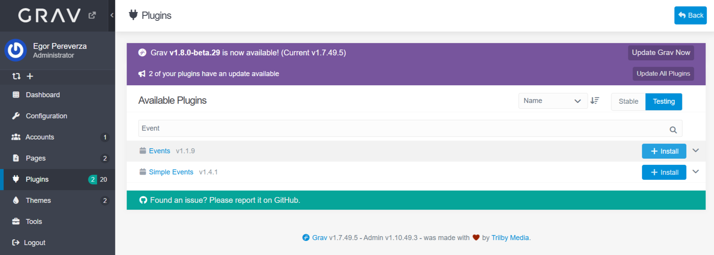
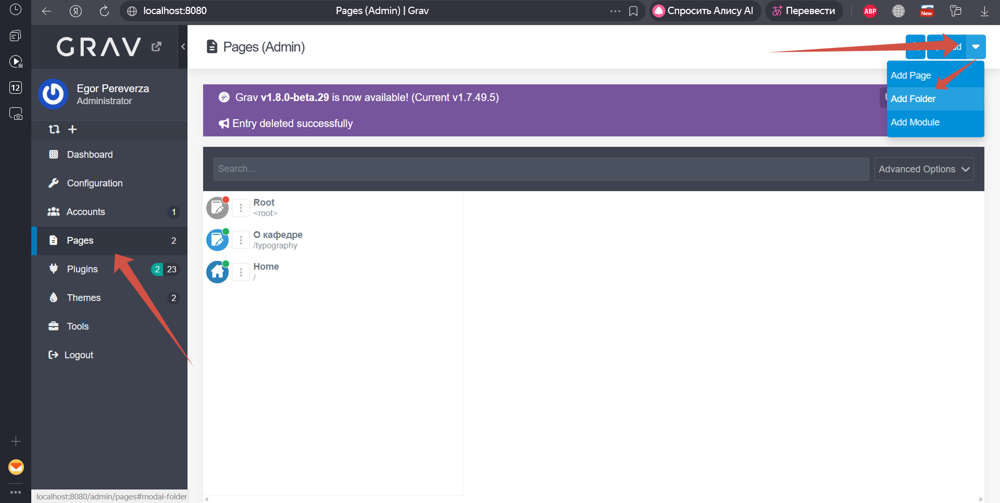
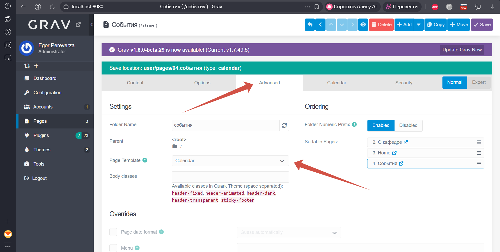
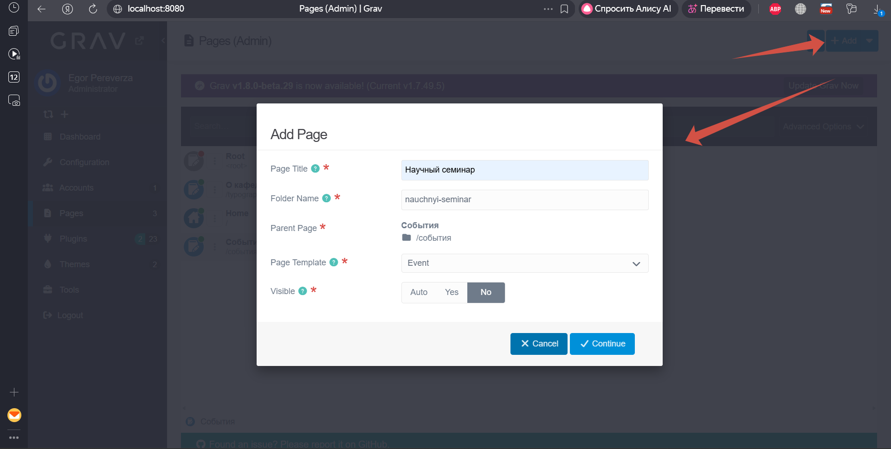
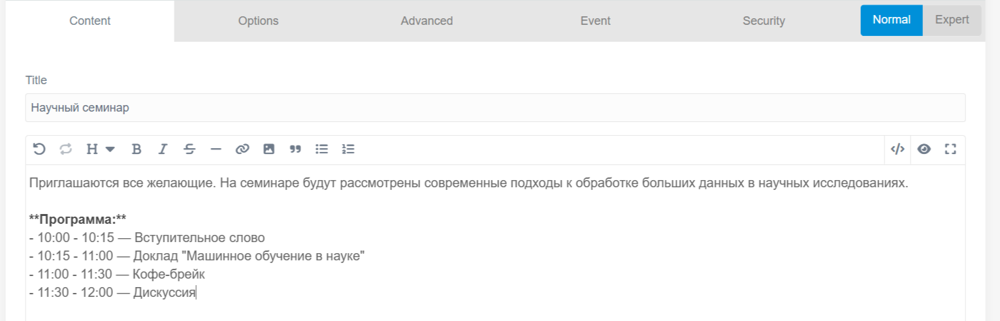
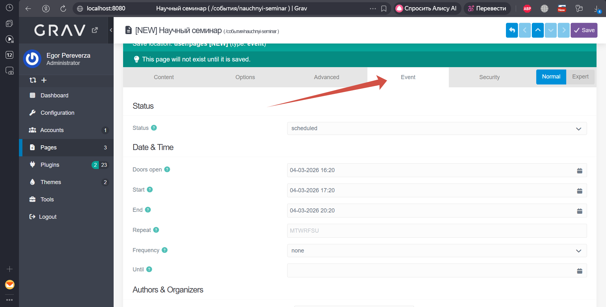
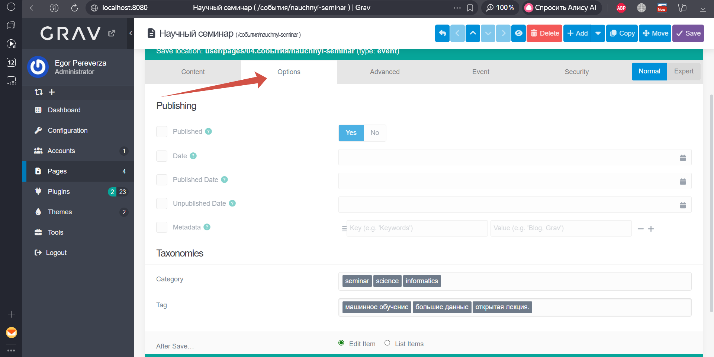
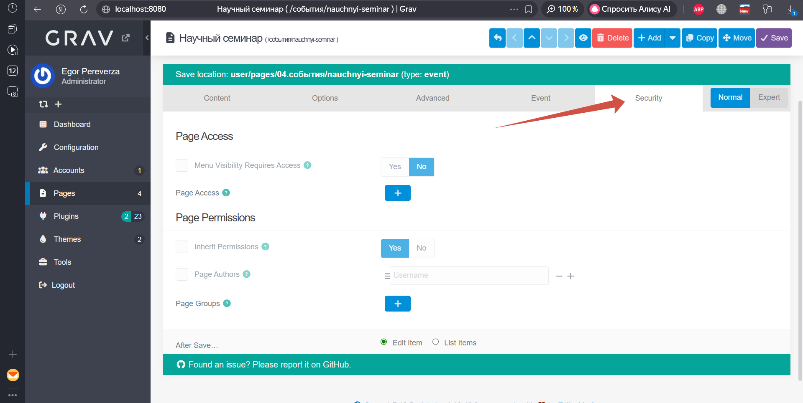
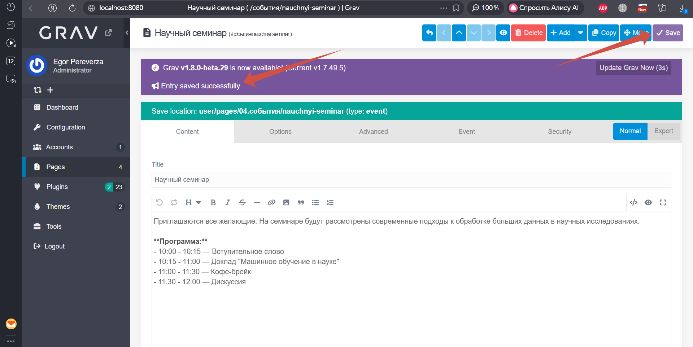
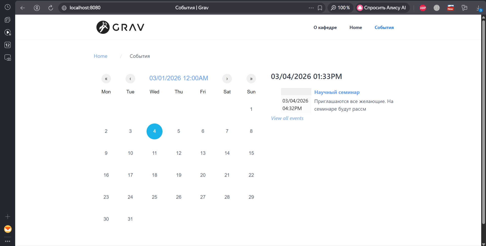

Выполнил: Переверза Е. А.
# **ВСР 2.2. Плагины Grav CMS**
## **Содержание**

1. **Задание 1. Таблица направлений**
    - [Таблица направлений и расширений (плагинов) для Grav](#таблица-направлений-и-расширений-плагинов-для-grav)
2. **Задание 2. Плагин Events**
    - [Установка плагина](#установка-плагина)
    - [Настройка плагина](#настройка-плагина)
    - [Демонстрация работы](#демонстрация-работы)
    - [Дополнительные настройки события](#дополнительные-настройки-события)
    - [Сохранение и просмотр результата](#сохранение-и-просмотр-результата)
    - [Возможные проблемы и их решение](#возможные-проблемы-и-их-решение)

### **Таблица направлений и расширений (плагинов) для Grav**

**Проведение конференции**

| Плагин (Ссылка) | Краткое описание | Комментарий |
| :--- | :--- | :--- |
| **[`Form`](https://github.com/getgrav/grav-plugin-form)** | Позволяет создавать формы любой сложности (подача заявок, регистрация, загрузка тезисов) с отправкой данных на email и сохранением в файлы. | **Универсальность и простота.** Для конференции нужен сбор заявок. `Form` — это стандартный и самый гибкий инструмент для этого. Легко настроить поля (ФИО, организация, тема доклада, файл для тезисов) и получать уведомления. В сочетании с `Email`-плагином позволяет автоматизировать процесс регистрации участников. |
| **[`Page-inject`](https://github.com/getgrav/grav-plugin-page-inject)** | Позволяет встраивать содержимое одной страницы (например, программы конференции или списка докладов) в другие страницы сайта. | **Актуальность информации.** Программа конференции часто меняется. Сделав её отдельной страницей и встроив её на главную или в другие разделы, вы гарантируете, что информация обновится везде одновременно, без копирования. |
| **[`Presentation`](https://github.com/olevik/grav-plugin-presentation)** | Плагин интегрирует мощную библиотеку Reveal.js в Grav. Он позволяет создавать красивые, адаптивные презентации и слайд-шоу непосредственно из Markdown-контента. Поддерживает двумерную навигацию (горизонтальные и вертикальные слайды), режим докладчика, заметки к слайдам и гибкую настройку внешнего вида. | Плагин выбран, так как идеально подходит для создания слайдов докладов, программы конференции и материалов для выступающих. Возможность управлять контентом через Markdown делает его простым в использовании для технических докладчиков, а гибкость Reveal.js удовлетворит самые взыскательные требования к дизайну презентации. |
| **[`Page TOC`](https://github.com/trilbymedia/grav-plugin-page-toc)** | Плагин автоматически генерирует оглавление (Table of Contents) для страницы на основе заголовков (H1, H2 и т.д.). Он также добавляет якорные ссылки рядом с заголовками, что упрощает навигацию по длинному документу. | Для сайта конференции этот плагин незаменим для страниц с программой, списком докладов или сборником тезисов. Он позволяет участникам быстро переходить к интересующему их докладу или секции, улучшая пользовательский опыт. |

**Публикация расписания преподавателей**

| Плагин (Ссылка) | Краткое описание | Комментарий |
| :--- | :--- | :--- |
| **[`Events`](https://github.com/pikim/grav-plugin-events)**<br>**[`Simple Events`](https://github.com/skinofthesoul/grav-plugin-simple-events)** | Плагин для календаря событий. Позволяет создавать события, отображать их в календаре и списке. | **Наглядность и экспорт.** Подходит для отображения графика консультаций, экзаменов или важных дат. Часто такие плагины поддерживают экспорт в формат iCal, что позволяет студентам импортировать расписание в свой личный календарь (Google, Outlook). |

**Публикация справочной информации**

| Плагин (Ссылка) | Краткое описание | Комментарий |
| :--- | :--- | :--- |
| **[`Knowledge Base`](https://github.com/Perlkonig/grav-theme-knowledge-base) (тема)** | Хотя это тема, она тесно связана с плагинами и создана специально для организации баз знаний. Она обеспечивает структуру для удобной навигации по справочным статьям, включает поиск и категоризацию. | Для публикации тематической справочной информации (документации, FAQ, глоссария) эта тема предоставляет лучшую отправную точку "из коробки". Ее можно дополнить плагинами для поиска (TNTSearch) и оглавления (Page TOC), чтобы создать полноценный справочный портал. |
| **[`Archives`](https://github.com/getgrav/grav-plugin-archives)** | Плагин группирует страницы по месяцам и годам, создавая архивы. Обычно используется для блогов, но применим и для справочных разделов, где информация накапливается со временем. | Если справочная информация публикуется регулярно (новости, обновления документации, дайджесты), плагин Archives поможет посетителям ориентироваться во времени и находить материалы за определенный период. |

**Универсальное (для всех направлений)**

| Плагин (Ссылка) | Краткое описание | Комментарий |
| :--- | :--- | :--- |
| **[`TNTSearch`](https://github.com/trilbymedia/grav-plugin-tntsearch)** | Мощный поисковый движок для Grav, использующий библиотеку TNTSearch. Он создает индекс контента и обеспечивает быстрый и релевантный полнотекстовый поиск с поддержкой нечеткого соответствия (fuzzy search). | Этот плагин является must-have для любого из трех направлений, если сайт содержит более пары десятков страниц. Будь то поиск доклада на конференции, расписания конкретного преподавателя или термина в справочнике — TNTSearch значительно улучшает навигацию и доступность информации. |

### **Плагин Events**

**Ссылка на плагин:** [https://github.com/pikim/grav-plugin-events](https://github.com/pikim/grav-plugin-events)</br>

### **Установка плагина**
Плагин предлагает несколько альтернативных способов установки.
 - Установка через GPM.</br>
    Для установки плагина первым способом необходимо выполнить команду в корневой директории Grav:
    ```bash
    $ bin/gpm install events
    ```
- Установка через админ-панель.</br>

    1. Войти в админ-панель Grav
    2. Перейти в раздел Plugins
    3. Нажать Add и найти Events в списке доступных плагинов
    4. Нажать кнопку Install

<p style="text-align: center;">  </p>

### **Настройка плагина**

После установки плагин доступен в разделе плагинов. Основные настройки:

| Параметр                    | Значение по умолчанию | Описание                              |
| --------------------------- | --------------------- | ------------------------------------- |
| **Enable iCalendar import** | `No`                  | Включение импорта из iCalendar файлов |
| **iCalendar files**         | `[]`                  | Пути к .ics файлам для импорта        |
| **Translate dates**         | `No`                  | Включение перевода дат                |

Настройки по умолчанию подходят для работы.

### **Демонстрация работы**
Демонстрация плагина будет проводиться через админскую панель Grav v1.7.49.5

1. Создадим страницу со всеми событиями или расписанием.</br>
    - Требуется перейти на вкладку "Pages";
    - нажать Add folder;
    - выбрать название директории. </br>
    (Пример название: события, расписание, и т. д.) 

<p style="text-align: center;">  </p>

2. Настройка главной страницы событий.</br>
    - Нажать на название директории;
    - во вкладке content можно заполнить название и содержание страницы;
    - во вкладке "Advanced" найти поле "Page template" и выбрать "Calendar" или "Events".</br>
    Шаблон "Calendar" будет отображать события в виде календаря, по нему можно будет удобно </br>
    перемешаться и смотреть например расписание. Шаблон "Events" будет отображать события в виде списка.

<p style="text-align: center;">  </p>

3. Создание событий.
    - Перейти на вкладку "Pages" в панели навигации;
    - Выбрать "Add page";
    - В появившемся окне заполнить поля:
        - Page Title - название страницы;
        - Folder Name - заполнится автоматически после ввода названия;
        - Parent Page - выбрать директорию из шага 1;
        - Page Template - выбрать шаблон Event;
        - Visible - выбрать No.

<p style="text-align: center;">  </p>

4. Настройка основных параметров события.
    - Перейти в созданное событие;
    - Вкладка Content, в поле редактора можно добавить подробное описание события;
    <p style="text-align: center;">  </p>

    - Вкладка Event.</br>
    В данной вкладке расположены основные параметры событий:
        - статус;
        - дата и время;
        - авторы и организаторы;
        - исключения дат;
        - билет;
        - расположение.

        Про каждое можно прочитать подробно, если навестить на знак вопроса рядом.
    <p style="text-align: center;">  </p>

### **Дополнительные настройки события**

1. Вкладка Options.</br>
    Для удобной фильтрации событий можно настроить таксономию:
    - в поле Category можно добавить категории, например: seminar, science, informatics;
    - в поле Tag можно добавить теги, например: машинное обучение, большие данные, открытая лекция.
    </br>

    Также в этой вкладке можно настроить поля:
    - Published - Опубликовать событие сразу;
    - Publish Date - Если нужно отложить публикацию;
    - Unpublish Date - Если событие должно скрыться после окончания;
    - Visible - Видимость в меню и списках.

<p style="text-align: center;">  </p>

2. Вкладка Security.</br>
    Если событие должно быть доступно только определенным группам пользователей.

<p style="text-align: center;">  </p>

### **Сохранение и просмотр результата**

После заполнения всех необходимых полей:
- Нажмите кнопку Save в правом верхнем углу;
- Дождитесь сообщения об успешном сохранении.

<p style="text-align: center;">  </p>

Данное событие можно просмотреть на странице, созданной на шаге 1 [демонстрации работы](#демонстрация-работы).

<p style="text-align: center;">  </p>

### **Возможные проблемы и их решение**

| Проблема                | Вероятная причина              | Решение                       |
| ----------------------- | ------------------------------ | ----------------------------- |
| Событие не отображается | Не выбран шаблон Event         | Проверить вкладку Template    |
| Неправильные даты       | Неверный формат MM/DD/YYYY     | Исправить формат даты         |
| Повторения не работают  | Не заполнены Repeat и/или Freq | Заполнить все поля повторения |
| Не работает фильтрация  | Таксономии не активированы     | Проверить system.yaml         |
