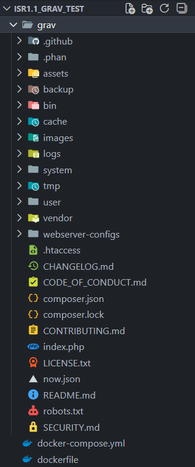
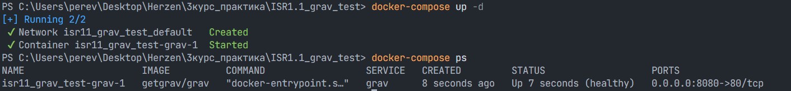
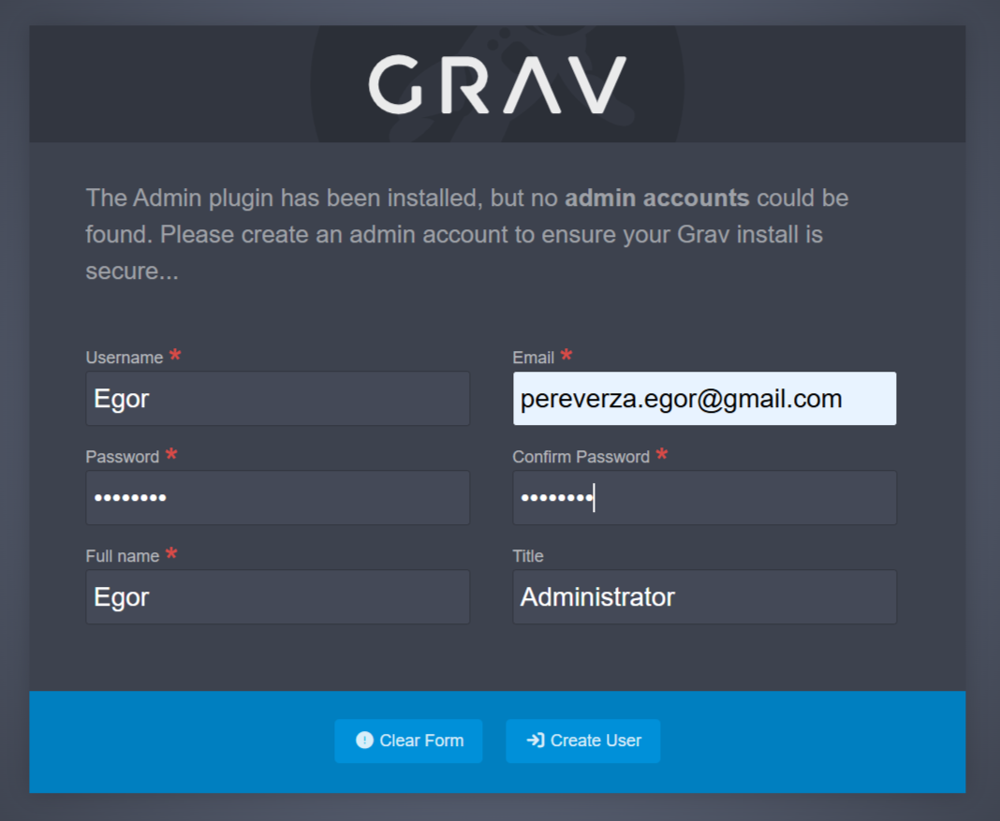
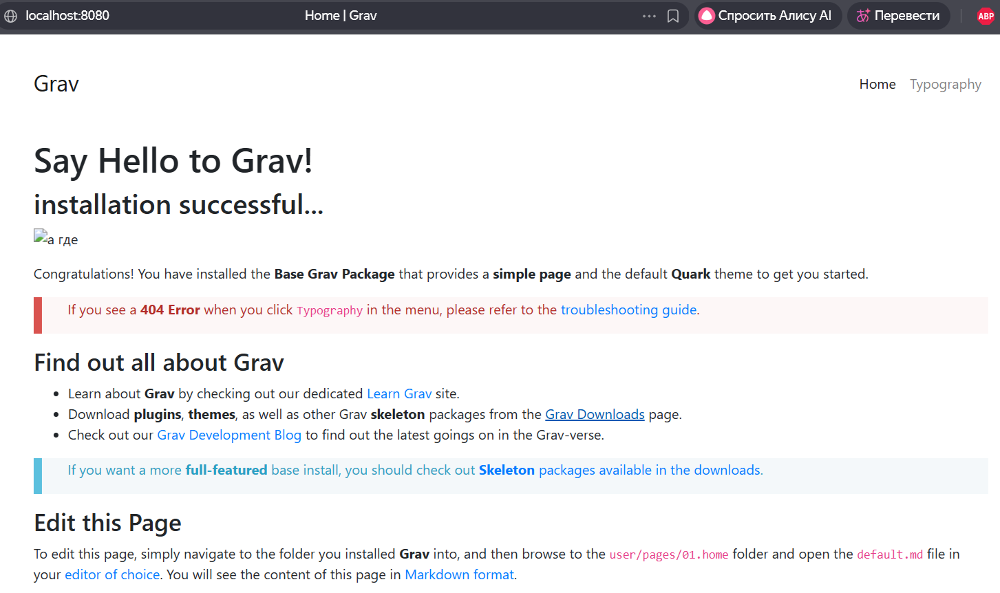
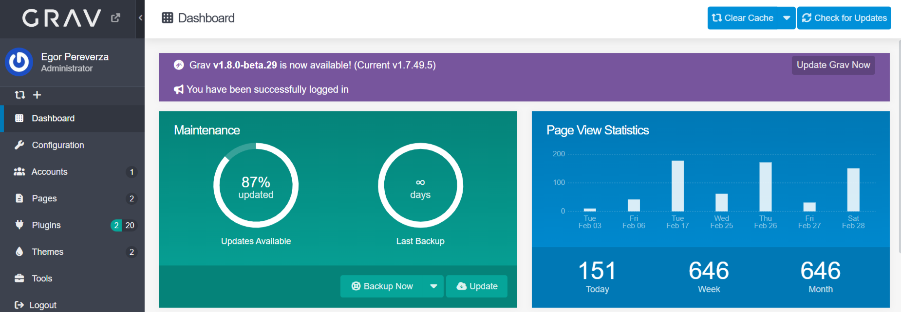

Выполнил: Переверза Е. А.
# **ИСР 1.1. Установка Grav CMS с помощью Docker**
## **Содержание**

1. **Провести инсталляцию программного обеспечения**
    - [Создание и настройка проекта](#создание-и-настройка-проекта)
    - [Настройка Docker](#настройка-docker)
    - [Запуск контейнера и проверка](#запуск-контейнера-и-проверка)
    - [Проверка установки](#проверка-установки)
2. **Темы для Grav**
    - [Скачивание темы](#скачивание-темы)
    - [Тема Bootstrap4](#Тема-Bootstrap4)
    - [Тема Quark](#тема-quark)

### **Создание и настройка проекта**
1. Создайте директорию с будущим проектом.
2. Создание структуры проекта.</br>
    Создайте в корне проекта следующие элементы:
    - docker-compose.yml
    - dockerfile
    - grav/

    На данном этапе ваша структура будет выглядеть следующим образом:
    ```text
    grav-project/
    ├── docker-compose.yml
    ├── dockerfile
    └── grav/
        └── (содержимое архива Grav)
    ```
3. Скачивание Grav CMS.</br>
    Скачайте Grav с [официального сайта](https://getgrav.org/downloads).</br>
    Требуется выбрать версию `core + admin plugin` 

4. Распакуйте архив в директорию grav.
<p style="text-align: center;">  </p>

### **Настройка Docker**
1. Содержание файла `docker-compose.yml`
```yml
services:
  grav:
    image: getgrav/grav
    ports:
      - "8080:80"
    volumes:
      - grav_site:/var/www/html
    restart: unless-stopped
    
volumes:
  grav_site:
```
2. Содержание файла `dockerfile`
```dockerfile
# =============================================================================
# Grav CMS Docker Image
# =============================================================================
# Build arguments:
#   PHP_VERSION          - PHP version (default: 8.3)
#   PHP_EXTENSIONS       - Core extensions (default: opcache intl gd zip)
#   PHP_EXTRA_EXTENSIONS - Additional extensions (default: empty)
#   GRAV_VERSION         - Grav version to install (default: latest)
#
# Examples:
#   docker build -t grav .
#   docker build --build-arg PHP_VERSION=8.4 -t grav:php84 .
#   docker build --build-arg PHP_EXTRA_EXTENSIONS="xdebug redis" -t grav:dev .
# =============================================================================

ARG PHP_VERSION=8.3
FROM php:${PHP_VERSION}-apache-bookworm

LABEL maintainer="Andy Miller <rhuk@getgrav.org> (@rhukster)"
LABEL org.opencontainers.image.source="https://github.com/getgrav/docker-grav"
LABEL org.opencontainers.image.description="Grav CMS Docker Image"

# Build arguments for PHP extensions
ARG PHP_EXTENSIONS="opcache intl gd zip"
ARG PHP_EXTRA_EXTENSIONS=""
ARG GRAV_VERSION=latest

# Environment variables
ENV GRAV_VERSION=${GRAV_VERSION} \
    GRAV_SETUP=true \
    GRAV_SCHEDULER=true \
    FIX_PERMISSIONS=false

# =============================================================================
# System Setup
# =============================================================================

# Enable Apache modules
RUN a2enmod rewrite expires headers

# Harden Apache configuration
RUN sed -i 's/ServerTokens OS/ServerTokens ProductOnly/g' \
        /etc/apache2/conf-available/security.conf && \
    sed -i 's/ServerSignature On/ServerSignature Off/g' \
        /etc/apache2/conf-available/security.conf

# Install system dependencies
RUN apt-get update && apt-get install -y --no-install-recommends \
    unzip \
    cron \
    git \
    curl \
    && rm -rf /var/lib/apt/lists/*

# =============================================================================
# PHP Extensions (using docker-php-extension-installer)
# =============================================================================

# Install docker-php-extension-installer for reliable extension management
# https://github.com/mlocati/docker-php-extension-installer

ADD --chmod=755 https://github.com/mlocati/docker-php-extension-installer/releases/latest/download/install-php-extensions /usr/local/bin/

# Install core PHP extensions required by Grav
RUN install-php-extensions ${PHP_EXTENSIONS}

# Install PECL extensions (apcu, yaml)
RUN install-php-extensions apcu yaml

# Install extra extensions if specified
RUN if [ -n "${PHP_EXTRA_EXTENSIONS}" ]; then \
        install-php-extensions ${PHP_EXTRA_EXTENSIONS}; \
    fi
    
# =============================================================================
# PHP Configuration
# =============================================================================

# Copy Grav-optimized PHP settings
COPY config/php-grav.ini /usr/local/etc/php/conf.d/php-grav.ini

# =============================================================================
# Entrypoint Setup
# =============================================================================

# Copy and configure entrypoint script
COPY docker-entrypoint.sh /usr/local/bin/docker-entrypoint.sh
RUN chmod +x /usr/local/bin/docker-entrypoint.sh

# Create directory for custom initialization scripts
RUN mkdir -p /docker-entrypoint.d

# Set up web root
RUN chown -R www-data:www-data /var/www/html

# =============================================================================
# Runtime Configuration
# =============================================================================

WORKDIR /var/www/html

# Expose HTTP port
EXPOSE 80

# Health check
HEALTHCHECK --interval=30s --timeout=10s --start-period=60s --retries=3 \
    CMD curl -f http://localhost/ || exit 1

# Volume for Grav site data
VOLUME ["/var/www/html"]

ENTRYPOINT ["docker-entrypoint.sh"]
CMD ["apache2-foreground"]
```

### **Запуск контейнера и проверка**
1. Запуск и сборка контейнера.
    
    ```text
    docker-compose up -d
    ```
    Примечание: должен быть запущен Docker Desktop, первая сборка будет долгой.
2. Проверка статуса контейнера.
    ```text
    docker-compose ps
    ```

Результат сборки.
<p style="text-align: center;">  </p>

**Основные команды для работы с контейнером:**

- Запуск в фоновом режиме `docker-compose up -d`
- Просмотр логов `docker-compose logs -f`,</br> либо вместо docker-compose up -d ввести `docker-compose up`
- Остановка контейнера `docker-compose down`
- Перезапуск контейнера `docker-compose restart`

**Возможные проблемы:**
- Порт 8080 уже занят.</br>
    Решение: Измените порт в docker-compose.yml:
    ```yml
    ports:
        - "8081:80"  # Используйте другой порт
    ```

### **Проверка установки**

Откройте браузер и перейдите по адресу: `http://localhost:8080`.</br>
По данному адресу будет находиться главная страница Grav.
Примечание: при первом запуске Grav попросит заполнить несколько полей и создать администратора.
<p style="text-align: center;">  </p>
<p style="text-align: center;">  </p>

Доступ к админской панели осуществляется по адресу: `http://localhost:8080/admin`
<p style="text-align: center;">  </p>

### **Скачивание темы**
 - [Скачать с официального сайта](https://getgrav.org/downloads/themes). Требует ручной установки.
 - Скачать в админской панели через вкладку "Themes".</br>
    Самый удобный вариант, так как сразу устанавливает тему локально.
 - Найти в интернете другую тему. Требует ручной установки.

 Выбрать тему можно в админской панели во вкладке "Themes".  


### **Тема Bootstrap4**

**Ссылка на тему:** [Bootstrap4](https://github.com/trilbymedia/grav-theme-bootstrap4) 

Тема долгое время не обновлялась и имеет 4 версию Bootstrap, актуальная версия на данный момент 5.3.8.</br> 
Данная тема выбрана как похожая на разработанный альтернативный дизайн в Figma.</br>
Благодаря [Bootstrap framework](https://getbootstrap.com/) имеет отличную адаптивность, </br>
но при этом много лишних CSS/JS, которые не используются. Требует сильные изменения </br>
под сайт кафедры (цвета, шрифты). Дизайн слишком универсальный. По моему мнению, для сайта кафедры </br>
нецелесообразно использование готовых тем, только если не нужен быстрый и дешевый вариант, </br>
который будет обладать рядом недостатков:
- уникальность;
- функциональность;
- производительность;
- брендирование;
- масштабирование;

**Скан созданной информационной страницы:** [Скан Bootstra4](./images/Скан_Bootstrap4.pdf) </br>
Примечание: возник конфликт плагинов нескольких тем, из-за которого </br>
в конечном итоге не отображаются картинки, но в [редакторе отображаются](./images/Скан_редактора_Grav.pdf). 

### **Тема Quark**

**Ссылка на тему:** [Quark Theme](https://github.com/getgrav/grav-theme-quark) 

Тема Quark выбрана как максимально адекватная для сайта кафедры. Является официальной и разработана </br>
командой проекта Grav. Тема имеет минималистичный, академический дизайн с встроенной поддержкой различных </br>
формата контента (документы, таблиц, изображения). Хорошая адаптивность, но менее гибкая чем Bootstrap. </br>
Легковесная, имеет минимум зависимостей. Имеет такой же ряд недостатков, как и тема Bootstrap. Считаю </br>
использование готовой темы нецелесообразным, за исключением некоторых моментов. </br> 
Хорошим вариантом будет создание собственной темы для Grav, что видно в [ИСР 1.3]().</br>

**Скан созданной информационной страницы:** [Quark](./images/Скан_Quark.pdf) </br>
Примечание: возник конфликт плагинов нескольких тем, из-за которого </br>
в конечном итоге не отображаются картинки, но в [редакторе отображаются](./images/Скан%20редактора%20Grav.pdf). 